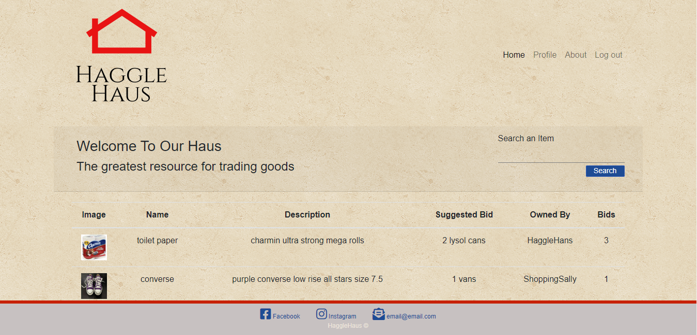
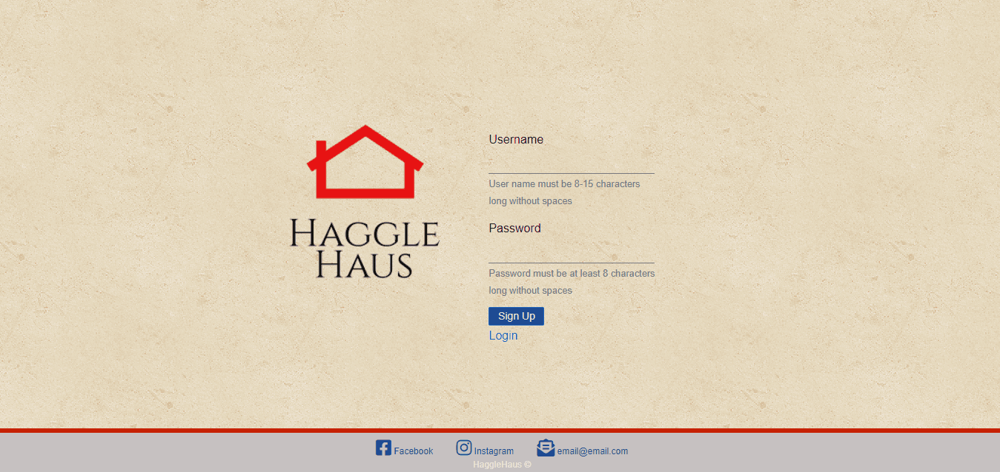
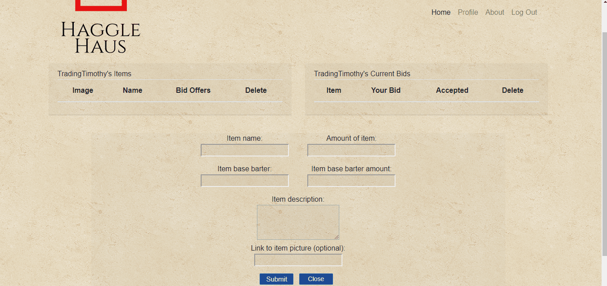

# Haggle Haus

Haggle Haus is a full-stack application which allows users to post trade items. Users are able to post items, as well as offer trades to other users.

[Visit the Haggle Haus!](https://haggle-haus.herokuapp.com)

## Using Haggle Haus

---

With Haggle Haus, Users can look though a vast database of available items and post their own items to trade.

## Signing up for an account.

---

To sign up or login to your account, simply visit [the Haggle Haus website](https://haggle-haus.herokuapp.com) and input your username and password. Once you are logged in, you will be taken to your own personal profile page.

## Adding an item to barter.

---

From your profile page, simply click the "Add barter item" and fill out the form in order to offer up an item to barter. Once created, you can track the bids on an item from your profile page.

## Adding a bid offer to an item.

---

From the Haggle Haus home, you can scroll to browse items or type a query into the search bar. Clicking on an item row in the marketplace table will reveal a form to offer a trade on the item. You can track the status of any offers you've made on other items from your profile page.

## Built With

---

- [Node](https://nodejs.org/en/) to power the server.
- [MySQL](https://dev.mysql.com/doc/) to serve as the primary database for storing users, items, and offered trades.
- [Sequelize](https://www.npmjs.com/package/sequelize) as the ORM for communicaiton between the Haggle-Haus API and the MySQL database.
- [Passport](https://www.npmjs.com/package/passport) for user signup and authentication.

## Authors

-[Carolyn Grady](https://github.com/cgrady3)  
-[Matthew Lipphardt](https://github.com/Mlipphardt)  
-[Bryan Wise](https://github.com/Coach-BWise)
